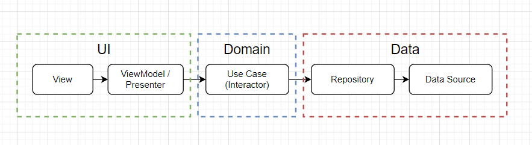

## Anisy: Anime Discovery App (Working Title)

Anisy is an Android application designed for anime enthusiasts to discover, explore, and track their
favorite anime shows. Built with a focus on modern Android development practices, Anisy leverages a
robust tech stack and a clean architecture for maintainability and scalability.

#### Features (Planned):
- Discover Anime: Browse a vast library of anime titles, filter by genre, season, and popularity.
- Detailed Information: Get comprehensive details about each anime, including synopsis, characters,
staff, and related shows. 
- Seasonal Charts: Stay up-to-date with the latest seasonal anime releases.
- Search Functionality: Easily find anime by title, genre, or other criteria.
- User Profiles: Create a profile to track your watched list, favorites, and plan-to-watch list.

## Screenshots

    

## Tech Stack:

- **Programming Language:** Kotlin
- **Asynchronous Programming:** Kotlin Coroutines
- **State Management:** LiveData, StateFlow, ViewModels
- **Dependency Injection:** Hilt
- **Local Storage:** Room Persistence Library
- **UI Framework:** Native Android
- **Networking:** Retrofit2
- **Image Loading:** Picasso
- **Data Serialization:** [kotlinx.serialization (JSON)](https://github.com/Kotlin/kotlinx.serialization)
- **Pagination:** Paging3
- **List & Grid Adapters:** Groupie
- **Navigation:** Jetpack Navigation Component
- **Testing:** JUnit, Mockito

## Project Structure:

The project follows a clean architecture approach combined with MVVM (Model-View-ViewModel) ,
separating concerns into three distinct layers:

    
    
<em>Layers of a clean architecture on Android with MVVM</em>

#### Presentation Layer (MVVM):

- ViewModels: Responsible for preparing and managing the UI state.
- Views: Handles user interactions and displays data from ViewModels.

#### Domain Layer:

- Contains the core business logic of the application, independent of any
specific framework or platform.

#### Data Layer:

- Handles data access and persistence, interacting with external APIs and local databases.

 

**Disclaimer**:
This project is under development and may not be fully functional. The features and design are
subject to change.